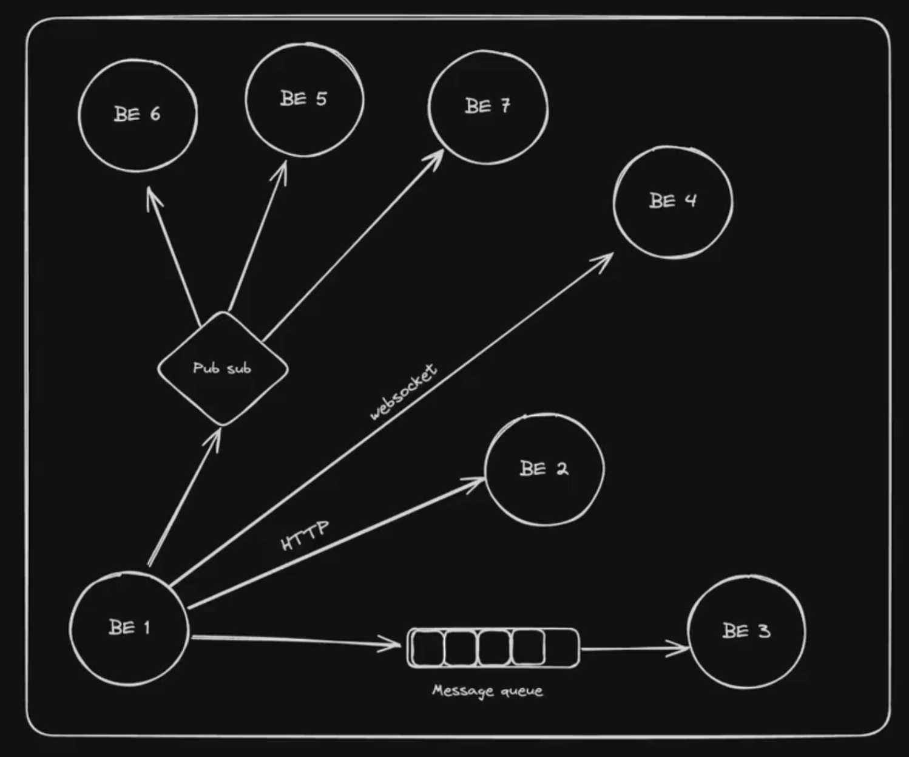

# Adv Backend Communications

## What is backend communication

## Types of Communication

- **Synchronous (Strong coupling)** : One system is directly pinging another system and wait for a response from another server.
  - HTTP (REST/GraphQL)
    - When you send the data you wait for the response
  - Websocket (debatable if sync or async)
    - When you send the data you don't really wait for the response
- **Asynchronous (Weak coupling)**
  - Messaging queues
  - Pub Subs
  - Server-Sent Events
  - Websocket (debatable if sync or async)

- There is something inefficiency in HTTP where Websocket resolve that issue
- In HTTP, server cannot sent the requests.
- WebSockets
  - WebSockets provide a way to establish a persistent, full-duplex communication channel over a single TCP connection between client(typically a web browser) and the server.
  - Use cases for web sockets
    - Real-Time Applications : Chat applications, live sports updates, real-time gaming, and any application requiring instant updates can benefit from WebSockets.
    - Live Feed : Financial tickers, news feeds, and social media updates are examples where WebSockets can be used to push live data to users
    - Interactive Services : Collaborative editing tools, live customer support chat, and interactive webinars can use WebScokets to enhance user interactio
  - Why not use HTTP/REST ? Why do you need ws?
    - Network Handshake happens for every request.
    - No way to push server side events (You can use polling but not the best approach)