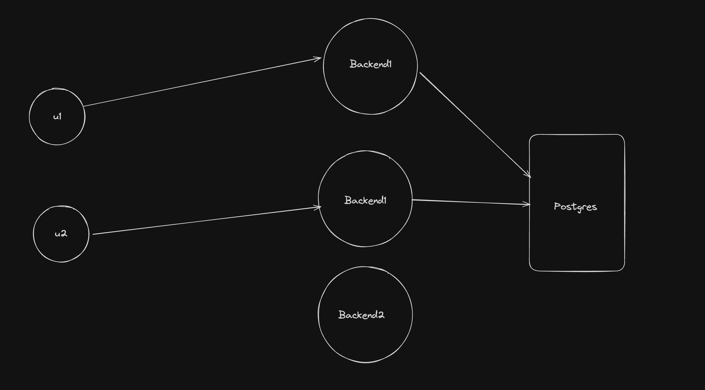

# Singleton Pattern, Backend State Management and Pub Subs

## What we're learning

- Stateful vs Stateless Backend
  - Basic interview question
  - If your are going scale the application
    - scaling the app based on the stateful or stateless varies eventually
- State management in Backend app
  - At max, we must avoid the using the state in the backend
    - But, if we are using it how can we manage the state
  - for example,
    - in the chess game, the backend can store all moves and validate the next instead of sending each every request to database which increases the latency
    - so we can store in-memory
- Singleton Pattern
  - Java design pattern
  - 
- Pub Subs + Singleton pattern

- What is the purpose of backend compared to frontend
  - backend has full access to the database
  - it can filter out what the frontend required
  - for example
    - if a user purchases courses the backend will only show the data which is related to his course details not other courses which are not purchased.
  - is there any way that frontend directly communicate to database
    - Yes, using backend as a service tools like firebase
