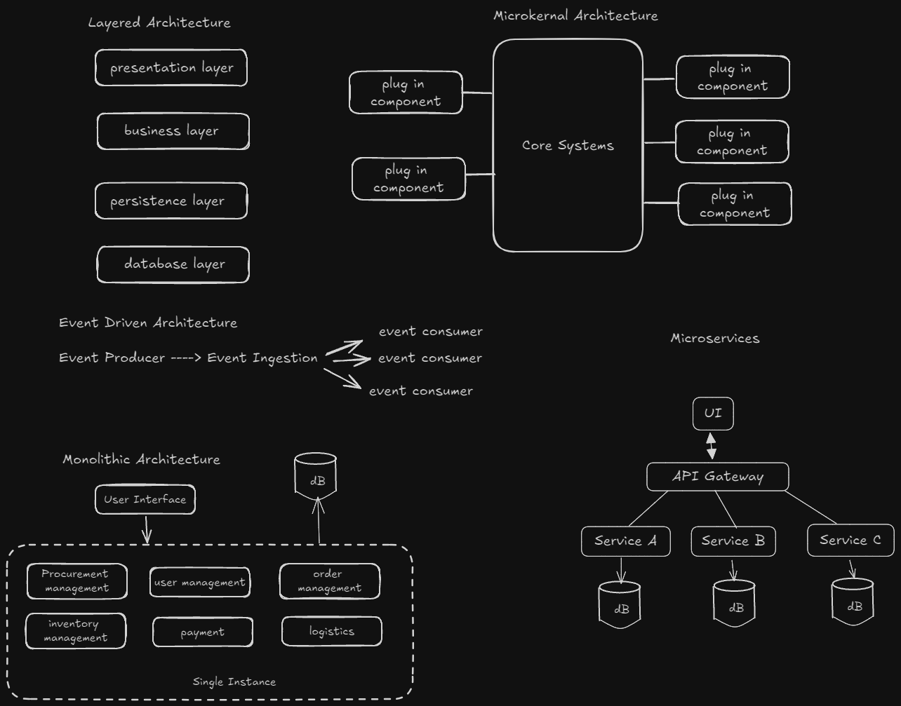

# Software Engineering

- **Top architecture patterns**
  - Layered Architecture
  - Event-Driven Architecture
  - Monolithic Architecture
  - Microkernal Architecture
  - Microservices Architecture
- separates the components of system into distinct layers
- pub sub model
- emphasies separating core systems functionalities into a small microkernal & extend the functionalities into add-ons or plugins
- decomposes an application into a collection of small lucy couple services
- 

